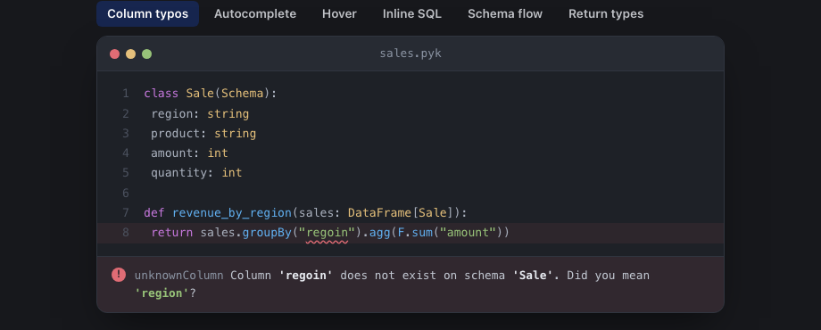

<p align="center"></p>

<h1 align="center">pykrete</h1>

<p align="center">
  <strong>Python dataframes, done right.</strong><br>
  Static type checking for dataframe schemas.
</p>

<p align="center">
  <a href="https://github.com/amirnaderi93/pykrete/actions/workflows/ci.yml"></a>
  <a href="https://github.com/amirnaderi93/pykrete-tests/actions/workflows/check.yml"></a>
  <a href="LICENSE"></a>
</p>

<p align="center">
  <a href="https://amirnaderi93.github.io/pykrete/"><strong>Docs</strong></a> ·
  <a href="https://amirnaderi93.github.io/pykrete/getting-started/install/">Install</a> ·
  <a href="https://amirnaderi93.github.io/pykrete/getting-started/quickstart/">Quickstart</a> ·
  <a href="docs/roadmap.md">Roadmap</a> ·
  <a href="CHANGELOG.md">Changelog</a>
</p>

---

pykrete is a strict superset of Python that adds a type layer for dataframes. Define a schema as a class, annotate a dataframe with `DataFrame[Schema]`, and pykrete checks every column you touch — at edit time, before your job runs. The runtime is plain Python; the type layer never executes. It's the same idea TypeScript brings to JavaScript, applied to dataframe code.

<p align="center">
  
  <br>
  <sub><em>A column typo, caught at edit time.</em></sub>
</p>

<p align="center">
  
  <br>
  <sub><em>The schema flows through every transform — hover the result to see the derived shape.</em></sub>
</p>

## Install

macOS / Linux:

```bash
brew install amirnaderi93/pykrete/pykrete
```

Windows: the [latest release](https://github.com/amirnaderi93/pykrete/releases/latest) ships an MSI installer. Other options — prebuilt binaries, `cargo install` — are in the [install guide](https://amirnaderi93.github.io/pykrete/getting-started/install/).

Each install gives you two binaries: `pykrete` (the checker, for CLI and CI) and `pykrete-lsp` (the language server for your editor).

## What you get

- **Typos caught as you type** — every column reference, against the schema in scope, with a _did you mean_.
- **Checks that follow the data** — `select` / `filter` / `withColumn` / `drop` / `join` / `groupBy` + `agg` / `pivot` / `union` and the rest; a reference to a column three transforms after it was dropped is still caught.
- **Schema visibility** — hover a `DataFrame[…]` parameter to see its columns; go-to-definition jumps to the schema.
- **TypeScript-style schema composition** — `Pick`, `Omit`, and `Merge` build derived shapes without redeclaring columns.
- **Column-name autocomplete** in string arguments.
- **Inline SQL checked too** — identifiers inside `filter("…")`, `selectExpr(...)`, `spark.sql("SELECT …")`.
- **Zero runtime cost** — `.pyk` is a strict superset of Python; the deployed job is ordinary Python.

## Reliability and trust

Pykrete is a development-time checker, not a runtime dependency. Your `.pyk` files transpile to plain Python — Spark runs the same Python it always did. **Pykrete cannot break a production pipeline because pykrete is not in the production pipeline.**

What this means in practice:

- **Static analysis runs in your editor, pre-commit hook, or CI.** The `pykrete` binary never ships to production hosts.
- **The transpile step is a rename plus a `from __future__ import annotations` injection** — no code transformation, no rewrites. Inspect the output if you want; it's byte-identical to your `.pyk` modulo the import.
- **Adopting pykrete is reversible.** Delete the `.pyk` extension, uninstall the binary, remove the VS Code extension. Your jobs run unchanged.

### How we earn confidence

We hold pykrete to PySpark's standard because that's the standard that matters:

- **Cross-tested against real PySpark codebases on every release.** The [pykrete-tests](https://github.com/amirnaderi93/pykrete-tests) repo vendors snapshots of Apache Spark and MLflow, annotates them the way a real adopter would, and runs `pykrete check` on every push and nightly. The same loop also runs against an internal production data-engineering codebase during the v1.0 hardening sprint. A false positive on real Spark code is a release blocker.
- **1,018 tests in CI across the analyzer, LSP, and wasm crates.** Every release has to pass the full suite, plus per-D-code snapshot tests that pin every error message — wording drifts fail the build until explicitly accepted.
- **JSON output is a stability contract from v1.0.0.** Field names, types, semantics, and D-code identity will not change without a SemVer-major bump and a corresponding `schemaVersion` bump. See [Production readiness → JSON output stability contract](https://amirnaderi93.github.io/pykrete/about/production-readiness/#json-output-stability-contract).
- **No-false-positives policy.** When pykrete cannot determine a schema or a type with confidence, it stops checking that subtree rather than guessing. A static checker that cries wolf gets switched off.
- **Pre-major-release audit cycle.** Every X.0.0 bump runs three independent fresh-eyes audits (architecture, Spark coverage, docs sync) before the tag. Findings ship in the release notes.

If pykrete is wrong on your code, [open an issue](https://github.com/amirnaderi93/pykrete/issues) — false positives are triaged ahead of everything else.

## Editor integration

The **VS Code extension** gives you live diagnostics, hover, completion, and go-to-definition on `.pyk` files. Search **pykrete** in the Extensions panel — it's on the [Visual Studio Marketplace](https://marketplace.visualstudio.com/items?itemName=amirnaderi.pykrete) (VS Code) and the [Open VSX Registry](https://open-vsx.org/extension/amirnaderi/pykrete) (Cursor, VSCodium, code-server, Theia).

For Neovim, Helix, Emacs, and other LSP clients, see [docs/editors/](docs/editors/).

## Documentation

Full documentation at **[amirnaderi93.github.io/pykrete](https://amirnaderi93.github.io/pykrete/)** — schema reference, diagnostic catalog, how it works, the roadmap.

Today: PySpark, feature-complete. Next: pandas and polars — see the [roadmap](docs/roadmap.md).

## Repository layout

- [`crates/`](crates/) — the Rust workspace: `pykrete` (checker + CLI) and `pykrete-lsp` (language server).
- [`editors/vscode/`](editors/vscode/) — the VS Code extension.
- [`docs/`](docs/) — design docs, the roadmap, and the source for the docs site.
- [`docs-site/`](docs-site/) — the Astro + Starlight documentation site.
- [`examples/`](examples/) — sample `.pyk` files.

## Contributing

See [CONTRIBUTING.md](CONTRIBUTING.md) for the development workflow — feature branches, Conventional Commits, CI, and the pull-request process.

## License

MIT. See [LICENSE](LICENSE).
