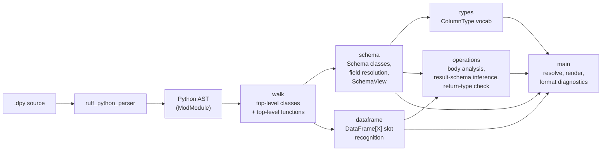

# Architecture

A snapshot of how dathon's checker is organized today. Will grow as the codebase grows.

## Pipeline



Today the checker is a single linear pass: parse → discover classes → recognize schemas → print. No type checking, no inference, no transpiler — those come later. The pipeline will fan out (more walks, more analyzers) but the basic shape stays.

## Crates

One crate, `dathon`, at [`crates/dathon/`](../../crates/dathon/). It is the CLI binary.

When we add a checker library (so an LSP can embed it), a transpiler, or a CLI argument parser big enough to need its own crate, they'll move into their own crates in the same workspace. The workspace `Cargo.toml` already supports that with zero migration.

## Modules in `dathon`

### `diagnostics`

A single struct, `Diagnostic`, with severity, code, message, line, column. `format()` emits the TypeScript-style line:

```
path:line:col - severity code: message
```

Line/column is computed eagerly at construction time using `ruff_source_file::LineIndex`. Diagnostics don't carry source references — they're self-contained for printing and later for aggregation.

### `walk`

Read-only AST walks. Today only `discover_top_level_classes`. Will grow to find function definitions, imports, `DataSource` registrations, etc.

`DiscoveredClass` wraps a `&StmtClassDef` plus convenience methods (`name`, `base_names`, `has_base`).

### `schema`

Recognizes which discovered classes are dathon schemas (bases include `Schema`) and exposes their field annotations as `(name, &Expr)` pairs. Field resolution lives here too: `SchemaField::resolve()` returns a `FieldResolution` enum (resolved column type, unknown type name, or non-bare-name) that the driver maps to diagnostics.

This module also owns `SchemaView`, the unified view used by body analysis. A `SchemaView` is either `Declared(&Schema)` (a user-defined Schema class) or `Derived(Vec<&str>)` (a schema inferred from operating on another). All field-existence and field-set comparisons (`has_field`, `field_names`, `display_name`) work identically against both — letting `D0030`, `D0040`, and `D0050` reason about schemas regardless of where they came from.

### `types`

The atom layer of dathon's type system. Today: one enum, `ColumnType`, with the v0.1 vocabulary (`int`, `long`, `double`, `string`, `bool`, `date`, `timestamp`). `from_name` parses user-written source forms; `as_str` / `Display` produce the canonical printable name. Mapping to Spark types (`IntegerType`, etc.) lives here when we get to the transpiler.

### `dataframe`

Recognizes DataFrame-typed annotations on function signatures. `recognize` classifies an annotation expression as `Untyped` (bare `DataFrame`), `Typed("Foo")` (`DataFrame[Foo]` with a bare-name schema), or `NonBareName` (`DataFrame[list[str]]`, etc.). `typed_slots` walks a function's parameters and return type and returns a list of every DataFrame-touching slot.

`DataFrame` is currently matched by literal name only — once import resolution lands, aliased imports (`from pyspark.sql import DataFrame as DF`) will be handled here.

### `operations`

PySpark DataFrame operation checking inside function bodies, with **result-schema inference** so chained calls and local variable bindings carry their schemas forward.

`BodyContext` holds a name → `SchemaView` map. It starts populated from typed function parameters; assignments grow it as the walker discovers `x = <DataFrame expression>`. **Annotated assignments** (`x: DataFrame[Schema] = …`) bind too — and they're authoritative: the annotation wins even if the RHS is something dathon can't track. This is the bridge for external sources like `dal.read(...)` and `spark.read.csv(...)` — the function call itself is opaque to dathon, but the annotation re-enters the typed world.

`BodyContext` also carries a reference to the file's `Schema` list (`find_schema`), so annotations encountered inside the body can be resolved to declared schemas the same way function-parameter annotations are.

`analyze_expr` is the recursive heart. Given an expression, it returns a `SchemaView` when the expression evaluates to a DataFrame and `None` otherwise. While walking, every recognized method call's arguments are checked against the receiver's schema (emitting `D0030`/`D0040`) and the operation's result schema is computed and returned.

Recursion is what enables chained calls: for `raw.filter(...).select("madeup")`, the outer `select` first analyzes its receiver (the `filter` call), which in turn analyzes *its* receiver (`raw`). Each level reports its own diagnostics and returns its result schema.

**Recognized methods today** (two families):

- **Column-method calls** — methods whose argument shape consists of column references / expressions. Each has one of three shapes:
  - **AllColumnName** — `select`, `drop`, `dropDuplicates`, `groupBy`. Top-level string-literal args are treated as column names; list-of-string args are unpacked.
  - **AllExpression** — `filter`, `where`. String literals are values; only `col("X")` references count as column refs.
  - **Positional** — `withColumn` (`[NewName, Expression]`), `withColumnRenamed` (`[ColumnName, NewName]`). Each argument position has its own role; extra args reuse the last role.
  Three roles (`ColumnName`, `Expression`, `NewName`) are combined into shapes via `column_method_shape` / `role_at`. Mismatched columns against the receiver schema emit `D0030`.

- **Two-DataFrame calls** — `union`, `unionByName`, `join`, `crossJoin`. The first argument is analyzed (recursively) to obtain its schema. The check depends on the method:
  - `union`/`unionByName` — the two schemas' field-name sets must match (`D0040`).
  - `join` — the `on=` argument is parsed: a string literal or list of string literals lists the join keys, anything else is treated as a complex on-expression and not checked. Named keys must exist on both sides (`D0060`).
  - `crossJoin` — no on-clause; nothing to check beyond the receivers themselves.

**Result-schema inference** (`apply_column_method` / two-DataFrame methods):

- `select(args)` → `Derived` schema whose fields are the output names of each arg (`alias("X")` wins; otherwise bare string literal, bare `col("X")`, or `.cast(...)` of those). Aliasless complex expressions silently drop.
- `filter`, `where`, `dropDuplicates` → schema-preserving (receiver's schema).
- `drop(...)` → receiver fields minus the dropped names.
- `withColumn("new", expr)` → receiver fields plus `"new"` (if not already present).
- `withColumnRenamed("old", "new")` → receiver fields with `"old"` replaced by `"new"`.
- `union` / `unionByName` → receiver's schema (assumes the names match — if not, `D0040` already flagged it).
- `join(other, on=…)` → keys appear once (left's value); non-key fields from both sides concatenated, with shared non-key names silently kept once (left wins). For a complex on-expression: same concatenation, no key dedup.
- `crossJoin(other)` → concatenation of left + right fields, shared names kept once.
- `groupBy(...)` → `None` (returns a `GroupedData`, not a DataFrame; subsequent `.agg(...)` calls aren't yet tracked).

**Return-type validation**: when a function declares `-> DataFrame[X]`, every `return <value>` has its inferred schema compared against `X`'s field set. Mismatches emit `D0050` listing what's missing in the body and what's extra.

Column reference discovery is a small recursive walker (`collect_col_refs`) that descends through `Call`, `Attribute`, `Subscript`, `BinOp`, `BoolOp`, `Compare`, `If`-expression, `Tuple`/`List`, and `Starred` — enough to find columns inside expressions like `(col("a") + col("b")).cast("int").alias("c")`. Scopes that bind new names (lambdas, comprehensions) are deliberately not entered.

The body walk is currently shallow (top-level statements only, direct calls on params only). Each new operation (`withColumn`, `withColumnRenamed`, `join`, …) and each new shape (chained calls, local-variable receivers, attribute-access columns) lands as an additive change here.

### `main`

CLI entry point. Parses args (manually for now; a real arg parser comes once we have more than `check`), reads the source file, drives parse → walk → schema → print.

## External dependencies

All git-pinned to `astral-sh/ruff` at tag `0.15.12`:

| Crate | Why |
| --- | --- |
| `ruff_python_parser` | Python parser. |
| `ruff_python_ast` | AST node types. |
| `ruff_source_file` | `LineIndex` for offset → line/column. |
| `ruff_text_size` | `TextSize` / `TextRange` / `Ranged` trait. |

Astral's policy is to keep ruff's internal crates off crates.io, so depending on git tags is the canonical pattern.

## Decisions in effect

- **Language: Rust.** Reasoning in the project README + memory.
- **Parser: ruff's, not our own.** Saves ~year of front-end work, tracks PEPs as they land.
- **Checker is standalone**, not a pyright/mypy plugin. Decision: full control over the type system.
- **`.dpy` is a strict superset of Python.** Files must parse with ruff's Python parser as-is, no new syntax in v0.1.
- **Catalyst is a specification + a test oracle, not a runtime dependency.** Operation semantics will match Spark's, but our checker will be a pure static analyzer.

See [docs/v0.1-spec.md](../v0.1-spec.md) for the user-facing contract.
