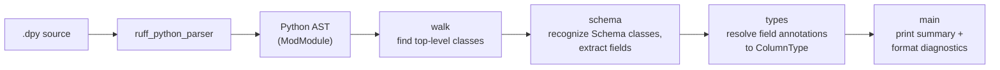

# Architecture

A snapshot of how dathon's checker is organized today. Will grow as the codebase grows.

## Pipeline



Today the checker is a single linear pass: parse → discover classes → recognize schemas → print. No type checking, no inference, no transpiler — those come later. The pipeline will fan out (more walks, more analyzers) but the basic shape stays.

## Crates

One crate, `dathon`, at [`crates/dathon/`](../../crates/dathon/). It is the CLI binary.

When we add a checker library (so an LSP can embed it), a transpiler, or a CLI argument parser big enough to need its own crate, they'll move into their own crates in the same workspace. The workspace `Cargo.toml` already supports that with zero migration.

## Modules in `dathon`

### `diagnostics`

A single struct, `Diagnostic`, with severity, code, message, line, column. `format()` emits the TypeScript-style line:

```
path:line:col - severity code: message
```

Line/column is computed eagerly at construction time using `ruff_source_file::LineIndex`. Diagnostics don't carry source references — they're self-contained for printing and later for aggregation.

### `walk`

Read-only AST walks. Today only `discover_top_level_classes`. Will grow to find function definitions, imports, `DataSource` registrations, etc.

`DiscoveredClass` wraps a `&StmtClassDef` plus convenience methods (`name`, `base_names`, `has_base`).

### `schema`

Recognizes which discovered classes are dathon schemas (bases include `Schema`) and exposes their field annotations as `(name, &Expr)` pairs. Field resolution lives here too: `SchemaField::resolve()` returns a `FieldResolution` enum (resolved column type, unknown type name, or non-bare-name) that the driver maps to diagnostics.

### `types`

The atom layer of dathon's type system. Today: one enum, `ColumnType`, with the v0.1 vocabulary (`int`, `long`, `double`, `string`, `bool`, `date`, `timestamp`). `from_name` parses user-written source forms; `as_str` / `Display` produce the canonical printable name. Mapping to Spark types (`IntegerType`, etc.) lives here when we get to the transpiler.

### `main`

CLI entry point. Parses args (manually for now; a real arg parser comes once we have more than `check`), reads the source file, drives parse → walk → schema → print.

## External dependencies

All git-pinned to `astral-sh/ruff` at tag `0.15.12`:

| Crate | Why |
| --- | --- |
| `ruff_python_parser` | Python parser. |
| `ruff_python_ast` | AST node types. |
| `ruff_source_file` | `LineIndex` for offset → line/column. |
| `ruff_text_size` | `TextSize` / `TextRange` / `Ranged` trait. |

Astral's policy is to keep ruff's internal crates off crates.io, so depending on git tags is the canonical pattern.

## Decisions in effect

- **Language: Rust.** Reasoning in the project README + memory.
- **Parser: ruff's, not our own.** Saves ~year of front-end work, tracks PEPs as they land.
- **Checker is standalone**, not a pyright/mypy plugin. Decision: full control over the type system.
- **`.dpy` is a strict superset of Python.** Files must parse with ruff's Python parser as-is, no new syntax in v0.1.
- **Catalyst is a specification + a test oracle, not a runtime dependency.** Operation semantics will match Spark's, but our checker will be a pure static analyzer.

See [docs/v0.1-spec.md](../v0.1-spec.md) for the user-facing contract.
