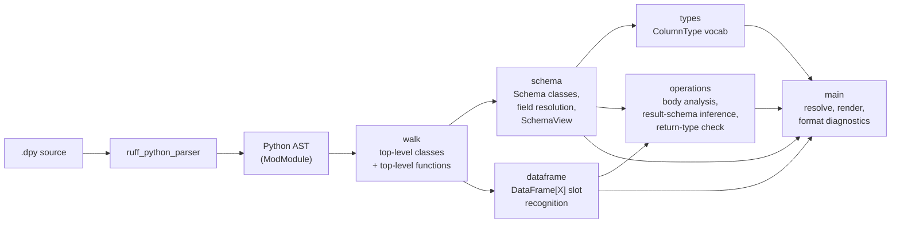

# Architecture

A snapshot of how dathon's checker is organized today. Will grow as the codebase grows.

## Pipeline



Today the checker is a single linear pass: parse → discover classes → recognize schemas → print. No type checking, no inference, no transpiler — those come later. The pipeline will fan out (more walks, more analyzers) but the basic shape stays.

## Crates

One crate, `dathon`, at [`crates/dathon/`](../../crates/dathon/). It is the CLI binary.

When we add a checker library (so an LSP can embed it), a transpiler, or a CLI argument parser big enough to need its own crate, they'll move into their own crates in the same workspace. The workspace `Cargo.toml` already supports that with zero migration.

## Modules in `dathon`

### `diagnostics`

A single struct, `Diagnostic`, with severity, code, message, line, column. `format()` emits the TypeScript-style line:

```
path:line:col - severity code: message
```

Line/column is computed eagerly at construction time using `ruff_source_file::LineIndex`. Diagnostics don't carry source references — they're self-contained for printing and later for aggregation.

### `walk`

Read-only AST walks. Today only `discover_top_level_classes`. Will grow to find function definitions, imports, `DataSource` registrations, etc.

`DiscoveredClass` wraps a `&StmtClassDef` plus convenience methods (`name`, `base_names`, `has_base`).

### `schema`

Recognizes which discovered classes are dathon schemas (bases include `Schema`) and exposes their field annotations as `(name, &Expr)` pairs. Field resolution lives here too: `SchemaField::resolve(schemas)` returns a `FieldResolution` enum with four variants:

- `Resolved(ColumnType)` — atomic type from the v0.1 vocabulary.
- `ResolvedNested(&Schema)` — the field's type is another declared Schema class. Models PySpark's `StructType`. Resolution order: atomic first, then a Schema lookup against the discovered list.
- `UnknownType { name }` — bare name that's neither atomic nor a Schema.
- `NotABareName` — subscript, attribute access, or other complex expression.

This module also owns `SchemaView`, the unified view used by body analysis. A `SchemaView` is either `Declared(&Schema)` (a user-defined Schema class), `Derived(Vec<&str>)` (a schema inferred from operating on another), or `Grouped { keys, underlying }` (a post-`groupBy` intermediate). All field-existence and field-set comparisons (`has_field`, `field_names`, `display_name`) work identically across them — letting `D0030`, `D0040`, and `D0050` reason about schemas regardless of where they came from.

For nested struct fields, the field name still appears at the top level (`User.has_field("address")` is true even when `address`'s type is the nested `Address` schema). Dotted column access (`col("address.street")`) is not yet supported in v0.1 — it would require path-traversal through nested schemas.

### `types`

The atom layer of dathon's type system. Today: one enum, `ColumnType`, with the v0.1 vocabulary (`int`, `long`, `double`, `string`, `bool`, `date`, `timestamp`). `from_name` parses user-written source forms; `as_str` / `Display` produce the canonical printable name. Mapping to Spark types (`IntegerType`, etc.) lives here when we get to the transpiler.

### `registry`

File-level registries of discovered classes and top-level typed constants — built once per check, before body analysis begins.

`ClassInfo` records every top-level class (Schema-derived or otherwise), its PEP 695 generic type parameters (`class Foo[T]`), and each of its method declarations. `MethodInfo` captures the method's name, type parameters (`def m[T]`), positional parameter annotations, and return-type annotation.

`ConstantInfo` records top-level annotated assignments of the simple shape `NAME: GenericClass[Schema] = …`. The outer generic class name is decorative (we treat any such constant as "carries the named schema") — the schema name resolves against the schema list to bind the constant as a `SchemaView::Declared` value during body analysis.

This module is read-only data; the substitution logic that uses it lives in `operations`.

### `dataframe`

Recognizes DataFrame-typed annotations on function signatures. `recognize` classifies an annotation expression as `Untyped` (bare `DataFrame`), `Typed("Foo")` (`DataFrame[Foo]` with a bare-name schema), or `NonBareName` (`DataFrame[list[str]]`, etc.). `typed_slots` walks a function's parameters and return type and returns a list of every DataFrame-touching slot.

`DataFrame` is currently matched by literal name only — once import resolution lands, aliased imports (`from pyspark.sql import DataFrame as DF`) will be handled here.

### `operations`

PySpark DataFrame operation checking inside function bodies, with **result-schema inference** so chained calls and local variable bindings carry their schemas forward.

`BodyContext` holds two name-resolution maps:

- `df_bindings: name → SchemaView` — DataFrame-typed function parameters, results of `x = <DataFrame expression>` assignments, and `x: DataFrame[Schema] = …` annotated assignments.
- `instance_bindings: name → class_name` — function parameters typed with a non-Schema class (`dal: DataAccessLayer`). These route method calls through the class registry instead of treating the receiver as a DataFrame.

`BodyContext::lookup(name)` consults the DataFrame bindings first, then **falls back to the constants registry**: a `NAME: GenericClass[Schema]` top-level constant resolves to a `SchemaView::Declared(Schema)` value just like a parameter does, so `dal.read(RAW_ORDERS)` can find `RAW_ORDERS`'s schema even though the constant is declared at module scope, not in the function's params.

**Annotated assignments** (`x: DataFrame[Schema] = …`) are authoritative: the annotation wins even if the RHS is something dathon can't track. This is the simple bridge for external sources when generic inference isn't available.

**Generic-method dispatch** (`handle_class_method_call`): when the receiver of a method call is a class instance, dathon looks the method up in the registry. If the method has type parameters and the parameter / return annotations match the simple shape `GenericClass[T] -> GenericClass[T]`, dathon binds `T` from the argument's schema and substitutes through the return. The result is a `SchemaView::Declared(Schema)` value that participates in the same chain analysis as everything else — so `dal.read(RAW_ORDERS).select(col("missing"))` correctly fires `D0030` against `RawOrders`.

`analyze_expr` is the recursive heart. Given an expression, it returns a `SchemaView` when the expression evaluates to a DataFrame and `None` otherwise. While walking, every recognized method call's arguments are checked against the receiver's schema (emitting `D0030`/`D0040`) and the operation's result schema is computed and returned.

Recursion is what enables chained calls: for `raw.filter(...).select("madeup")`, the outer `select` first analyzes its receiver (the `filter` call), which in turn analyzes *its* receiver (`raw`). Each level reports its own diagnostics and returns its result schema.

**Recognized methods today** (two families):

- **Column-method calls** — methods whose argument shape consists of column references / expressions. Each has one of three shapes:
  - **AllColumnName** — `select`, `drop`, `dropDuplicates`, `groupBy`. Top-level string-literal args are treated as column names; list-of-string args are unpacked.
  - **AllExpression** — `filter`, `where`. String literals are values; only `col("X")` references count as column refs.
  - **Positional** — `withColumn` (`[NewName, Expression]`), `withColumnRenamed` (`[ColumnName, NewName]`). Each argument position has its own role; extra args reuse the last role.
  Three roles (`ColumnName`, `Expression`, `NewName`) are combined into shapes via `column_method_shape` / `role_at`. Mismatched columns against the receiver schema emit `D0030`.

- **Two-DataFrame calls** — `union`, `unionByName`, `join`, `crossJoin`. The first argument is analyzed (recursively) to obtain its schema. The check depends on the method:
  - `union`/`unionByName` — the two schemas' field-name sets must match (`D0040`).
  - `join` — the `on=` argument is parsed: a string literal or list of string literals lists the join keys, anything else is treated as a complex on-expression and not checked. Named keys must exist on both sides (`D0060`).
  - `crossJoin` — no on-clause; nothing to check beyond the receivers themselves.

**Result-schema inference** (`apply_column_method` / two-DataFrame methods):

- `select(args)` → `Derived` schema whose fields are the output names of each arg (`alias("X")` wins; otherwise bare string literal, bare `col("X")`, or `.cast(...)` of those). Aliasless complex expressions silently drop.
- `filter`, `where`, `dropDuplicates` → schema-preserving (receiver's schema).
- `drop(...)` → receiver fields minus the dropped names.
- `withColumn("new", expr)` → receiver fields plus `"new"` (if not already present).
- `withColumnRenamed("old", "new")` → receiver fields with `"old"` replaced by `"new"`.
- `union` / `unionByName` → receiver's schema (assumes the names match — if not, `D0040` already flagged it).
- `join(other, on=…)` → keys appear once (left's value); non-key fields from both sides concatenated, with shared non-key names silently kept once (left wins). For a complex on-expression: same concatenation, no key dedup.
- `crossJoin(other)` → concatenation of left + right fields, shared names kept once.
- `groupBy(keys)` → `SchemaView::Grouped { keys, underlying }`. Not a DataFrame; only valid follow-up is `.agg(...)`. Other methods on a `Grouped` receiver collect `D0030` noise (their column references never match because `has_field` returns false on `Grouped`), which is acceptable in v0.1 since those calls are invalid in PySpark anyway.
- `.agg(args)` → `SchemaView::Derived` with [keys ∪ aliased aggregates]. Each arg's column references (both `col("X")` and string-arg form `F.sum("x")`) are checked against the underlying (pre-groupBy) schema. `.agg(...)` is also valid on a regular DataFrame; in that case there are no keys and the result is just the aliased aggregates.

**Aggregate function recognition**: `collect_col_refs` recognizes a small list of known PySpark aggregate names (`sum`, `avg`, `count`, `median`, `max_by`, `collect_list`, …) and treats their string-literal positional arguments as column references — so `F.sum("price")` resolves to a column ref to `"price"`. The list is conservative: only functions where every string arg is a column name are included (`lit` is excluded since `lit("x")` is a value, not a column).

**Return-type validation**: when a function declares `-> DataFrame[X]`, every `return <value>` has its inferred schema compared against `X`'s field set. Mismatches emit `D0050` listing what's missing in the body and what's extra.

Column reference discovery is a small recursive walker (`collect_col_refs`) that descends through `Call`, `Attribute`, `Subscript`, `BinOp`, `BoolOp`, `Compare`, `If`-expression, `Tuple`/`List`, and `Starred` — enough to find columns inside expressions like `(col("a") + col("b")).cast("int").alias("c")`. Scopes that bind new names (lambdas, comprehensions) are deliberately not entered.

Three column-reference shapes are recognized:

- `col("X")` — function-call form. Detected by name; the string-literal first arg is the column name.
- Bare string literal `"X"` — only treated as a column name in column-name contexts (top-level args of `select` / `drop` / `dropDuplicates` / `groupBy`, the rename-target arg of `withColumnRenamed`, list elements unpacked from `dropDuplicates(["a", "b"])`).
- `df.X` — attribute access on a Name. Only treated as a column reference when `df` is bound to a DataFrame in the current `BodyContext` (function parameter or local). This is the discriminator that filters out `F.add_months(...)`, `datetime.now()`, etc., where the receiver is a module / type, not a DataFrame. The column name `X` is checked against the *receiver's* schema — which `df` is named is ignored, mirroring Spark's "any column in scope" semantics after a join.

The body walk is currently shallow (top-level statements only, direct calls on params only). Each new operation (`withColumn`, `withColumnRenamed`, `join`, …) and each new shape (chained calls, local-variable receivers, attribute-access columns) lands as an additive change here.

### `transpiler`

`.dpy` → `.py` emit, exposed via `dathon::transpile(source)`. Because `.dpy` is a strict superset of Python (deliberately — see the v0.1 spec), the transpiler is mostly an identity transform. The one transformation it does perform is prepending `from __future__ import annotations` to the source, which defers evaluation of all type annotations to strings.

That single change matters for two reasons:

1. dathon's atomic type names — `string`, `double`, `timestamp`, `date`, `long`, `bool` — aren't Python builtins. Without deferred annotations, `x: timestamp` would raise `NameError` at runtime.
2. `DataFrame[X]`, `DataSource[X]`, and other `Generic[Schema]` annotation shapes use `__class_getitem__` semantics that some real classes (e.g. PySpark's `DataFrame`) don't implement. Without deferred annotations, evaluating them raises `TypeError`.

Both vanish with the future import. No AST walking, no source reshaping; just one prepended line.

Schema base classes (the user's `class Foo(Schema):` declarations) still need the name `Schema` bound to *something* at runtime. The transpiler doesn't inject this — that's a runtime concern. Users either import a real `Schema` from a future `dathon` Python package or define a no-op base class.

### `main`

CLI entry point. Dispatches `dathon <check|transpile> <file.dpy>` to the matching library entry point.

## External dependencies

All git-pinned to `astral-sh/ruff` at tag `0.15.12`:

| Crate | Why |
| --- | --- |
| `ruff_python_parser` | Python parser. |
| `ruff_python_ast` | AST node types. |
| `ruff_source_file` | `LineIndex` for offset → line/column. |
| `ruff_text_size` | `TextSize` / `TextRange` / `Ranged` trait. |

Astral's policy is to keep ruff's internal crates off crates.io, so depending on git tags is the canonical pattern.

## Decisions in effect

- **Language: Rust.** Reasoning in the project README + memory.
- **Parser: ruff's, not our own.** Saves ~year of front-end work, tracks PEPs as they land.
- **Checker is standalone**, not a pyright/mypy plugin. Decision: full control over the type system.
- **`.dpy` is a strict superset of Python.** Files must parse with ruff's Python parser as-is, no new syntax in v0.1.
- **Catalyst is a specification + a test oracle, not a runtime dependency.** Operation semantics will match Spark's, but our checker will be a pure static analyzer.

See [docs/v0.1-spec.md](../v0.1-spec.md) for the user-facing contract.
