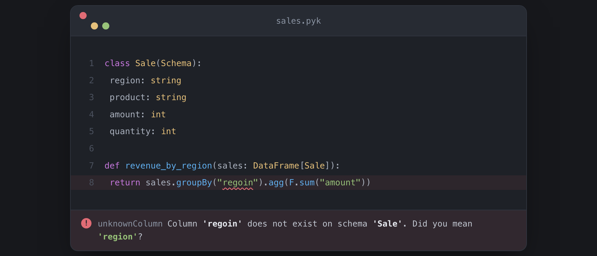
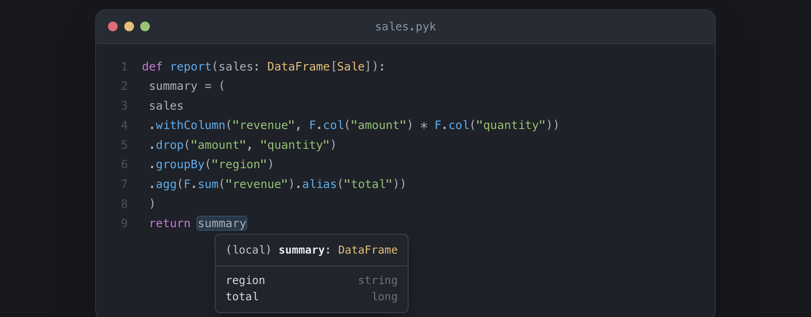

# pykrete for VS Code

**Static type checking for dataframe schemas — in your editor.**

[](https://open-vsx.org/extension/amirnaderi/pykrete)

pykrete is a strict superset of Python that adds a type layer for dataframes. This extension brings its schema checks into VS Code (and Cursor, VSCodium, code-server, Theia): live diagnostics, hover, completion, go-to-definition, and quick-fixes on `.pyk` files. New to pykrete? Start with the [documentation](https://amirnaderi93.github.io/pykrete/).

<p align="center">
  
  <br>
  <sub><em>A column typo, caught at edit time.</em></sub>
</p>

<p align="center">
  
  <br>
  <sub><em>The schema flows through every transform — hover the result to see the derived shape.</em></sub>
</p>

## What it gives you

**Column typos, caught as you type.** Every column reference — `col("x")`, `df.x`, `df["x"]`, dotted paths into nested structs, string arguments to functions like `F.sum("x")` — is checked against the schema in scope. A misspelling gets a red underline and a *did you mean*.

**Checks that follow the data.** pykrete tracks the schema through `select`, `filter`, `withColumn`, `drop`, `join`, `groupBy` + `agg`, `pivot`, `union`, and the rest. Reference a column three transforms after it was dropped, and the squiggle lands exactly where you used it.

**Hover to see a schema.** Hover a `DataFrame[…]` parameter and see its columns without leaving the file. Go-to-definition jumps to the schema declaration.

**Autocomplete for column names.** Type a column name in a string argument and pykrete completes the ones that actually exist on the dataframe in scope.

**Quick-fixes.** Accept a *did you mean* suggestion with a single action.

**Full Python support, included.** The extension bundles a Python language server, so you also get ordinary Python hover, completion, go-to-definition, find-references, and type diagnostics — for free, in the same extension. Nothing else to install, no `files.associations`, no configuration.

## Requirements

The extension needs the `pykrete-lsp` binary on your `PATH`. Install it via any of:

- **Homebrew** (macOS / Linux): `brew install amirnaderi93/pykrete/pykrete`
- **Windows**: download the MSI from the [latest release](https://github.com/amirnaderi93/pykrete/releases/latest)
- **From source** (Rust ≥ 1.95): `cargo install --git https://github.com/amirnaderi93/pykrete pykrete pykrete-lsp`

Each installs both `pykrete` and `pykrete-lsp`. Homebrew and the MSI put the binary on your `PATH` automatically. Full options in the [install guide](https://amirnaderi93.github.io/pykrete/getting-started/install/).

The bundled Python language server runs on **Node.js**. If `node` isn't on your `PATH`, pykrete's schema features still work fully — only the general Python features are unavailable.

## Install the extension

- **VS Code** — search **pykrete** in the Extensions panel, or run `code --install-extension amirnaderi.pykrete`.
- **Cursor / VSCodium / code-server / Theia** — search **pykrete** in the Extensions panel (served from the Open VSX Registry).
- **Offline / locked-down environments** — every [pykrete release](https://github.com/amirnaderi93/pykrete/releases) attaches a `.vsix`; install it with **Extensions panel → ⋯ → Install from VSIX…**

Open a `.pyk` file and the checks start immediately. Have existing PySpark `.py` files? Rename one to `.pyk` — it's a strict superset of Python, so the file still runs unchanged. The [quickstart](https://amirnaderi93.github.io/pykrete/getting-started/quickstart/) walks through it in five minutes.

## Settings

| Setting | Purpose |
|---|---|
| `pykrete.serverPath` | Path to the `pykrete-lsp` binary. Defaults to discovering it on `PATH` (and the workspace `target/` directory, for contributors). |
| `pykrete.pythonServer.path` | Path to a `basedpyright-langserver` / `pyright-langserver` binary, to use instead of the bundled Python engine. |

Project behavior — type-checking strictness, excluded paths, per-rule severity — is configured with a `pykrete.json` file; see [Configuration](https://amirnaderi93.github.io/pykrete/reference/configuration/).

## Links

- [Documentation](https://amirnaderi93.github.io/pykrete/)
- [Source & issues](https://github.com/amirnaderi93/pykrete)
- [Changelog](CHANGELOG.md)

## Development

To build the extension from source:

```sh
npm install        # also fetches the bundled Python engine (~40 MB)
npm run compile    # one-shot; `npm run watch` rebuilds on save
npx vsce package   # produces a .vsix
```

During development the extension finds `pykrete-lsp` in the workspace's `target/release/` directory — run `cargo build --release -p pykrete-lsp` from the repo root first.

MIT licensed.
